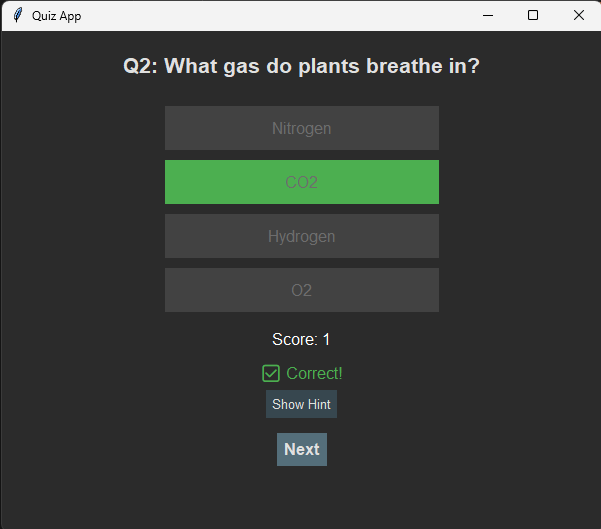

# 🧠 Quiz App – Tkinter Based Multiple Choice Quiz

The **Quiz App** is a simple desktop program created using Python’s Tkinter library. It offers a fun and interactive quiz experience on general knowledge questions. Designed with a clean dark theme to reduce eye fatigue, it ensures smooth readability and an enjoyable user experience.

Each time the quiz is played, the questions and options are shuffled to make it feel fresh and new. The application provides **instant feedback** for each response, and also includes a **hint** feature to encourage users to think more deeply.

---

## ✨ Features

- 🎨 Dark-themed, readable interface  
- 🔄 Randomized questions and answers  
- ✅ Immediate feedback on each answer  
- 💡 Helpful hints to assist in thinking  
- 📊 Score tracker and final score display  
- 🔁 Option to restart the quiz  
- 🖱️ Clickable GUI made using Tkinter  

---

## 📸 Demo & Screenshots


https://github.com/user-attachments/assets/84464293-2caf-41c5-87fa-1498d78039a1


<table style="width:100%">
  <tr>
    <td></td>
    <td></td>
  </tr>
  <tr>
    <td></td>
    <td></td>
  </tr>
  <tr>
    <td colspan="2"></td>
  </tr>
</table>

---

## 🛠 Technologies Used

- Python 🐍  
- Tkinter 🖼️  
- Random module 🎲 

---

## 📂 How to Run

1. Clone the repository:
   ```bash
   git clone https://github.com/officialayushyadav15/quiz-app.git
   cd quiz-app
```
```
2. Run the script:

   ```bash
   python quiz_app.py
   ```

---

## 🙌 Thank You

A huge thanks to the **Code in Place** team at Stanford University for the amazing learning opportunity. This project was developed as part of my final submission for Code in Place. The experience truly helped strengthen my Python and GUI skills.

---

## 🧑‍💻 About Me

I'm **Ayush Yadav**, a passionate developer who enjoys building projects in the fields of computer vision, automation, and innovative tech solutions. I love learning new things and solving real-world problems through code.

### 🔗 Connect with Me

* 📧 Email: [officialayushyadav15@gmail.com](mailto:officialayushyadav15@gmail.com)
* 💼 GitHub: [@officialayushyadav15](https://github.com/officialayushyadav15)
* 🔗 LinkedIn: [Ayush Yadav](https://www.linkedin.com/in/ayush-yadav-408924230/)

---

## 🤝 Contributions

If you find any bugs or want to suggest improvements, feel free to open an issue or a pull request. All contributions are welcome!

---

